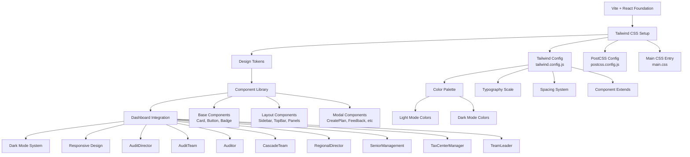
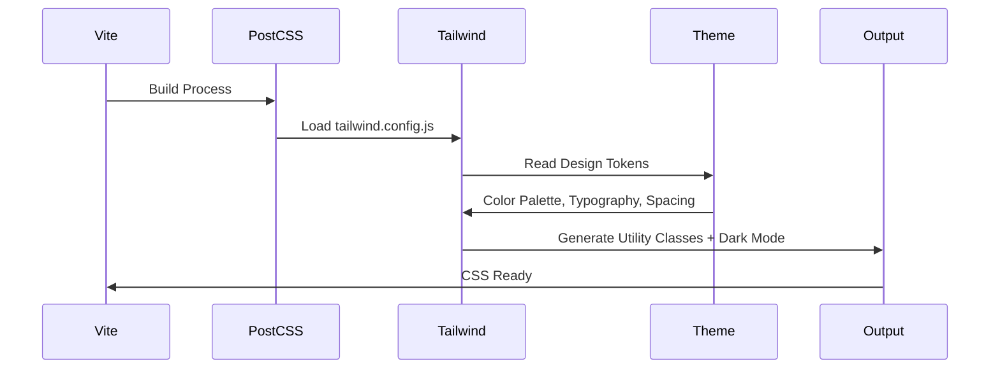

# Design Document: Tailwind CSS Conversion for AP Cluster Frontend

## Overview

This design document outlines the strategic approach for converting the entire AP Cluster Frontend from a mixed styling approach (inline styles + custom CSS) to a comprehensive Tailwind CSS utility-first system. The project contains 8 role-based dashboards, multiple component types (cards, buttons, modals, layouts), and existing dark mode support that must be preserved and enhanced during the conversion. The goal is to establish a scalable, maintainable design system using Tailwind's configuration capabilities while maintaining visual consistency across all dashboards and reducing the codebase's style maintenance burden.

## Architecture



## Components and Interfaces

### 1. Tailwind CSS Integration Layer

#### 1.1 Setup Architecture



**Setup Components:**

- **tailwind.config.js**: Central configuration with design tokens, dark mode, component extends
- **postcss.config.js**: Plugin chain for Tailwind processing and CSS optimization
- **src/main.css**: Tailwind directives and custom component definitions
- **package.json**: Updated dev dependencies (tailwindcss, postcss, autoprefixer)

#### 1.2 Design Tokens Configuration

The Tailwind configuration will centralize all design decisions:

```
tailwind.config.js
├── Colors (Light/Dark Mode)
│   ├── Primary (blue spectrum)
│   ├── Semantic (success, warning, error, info)
│   ├── Neutral (backgrounds, text, borders)
│   └── Status (approved, pending, rejected)
├── Typography
│   ├── Font Family (System stack)
│   ├── Font Sizes (sm, base, lg, xl, 2xl)
│   └── Line Heights & Letter Spacing
├── Spacing (4px base unit)
├── Border Radius (subtle, normal, rounded)
├── Shadows (depths)
└── Breakpoints (responsive)
```

### 2. Design Token System

#### 2.1 Color Palette Architecture

**Light Mode** (CSS variables):
- `--primary-50` through `--primary-900` (blue spectrum)
- `--gray-50` through `--gray-900` (neutral backgrounds/text)
- `--success-*`, `--warning-*`, `--error-*`, `--info-*` (semantic)
- `--card`, `--border`, `--text-primary`, `--text-secondary`

**Dark Mode** (CSS variables + @media):
- Inverted color scheme maintaining contrast
- Preserved accent colors for status indicators
- Enhanced readability for dark backgrounds

#### 2.2 Tailwind Color Mapping

```
Light Mode:
  text-primary → --text-primary (from theme)
  bg-card → --card (from theme)
  border-divider → --border (from theme)
  
Dark Mode (via @media prefers-color-scheme: dark):
  text-primary → inverted to light gray
  bg-card → inverted to dark gray
  border-divider → inverted to subtle dark border
```

#### 2.3 Semantic Color Usage

- **Status Indicators**: green (approved), orange (pending), red (rejected), blue (info)
- **Action Buttons**: primary (submit), secondary (cancel), danger (delete)
- **Alerts**: error (red), warning (orange), success (green), info (blue)

### 3. Component Pattern Library

#### 3.1 Base Component Patterns

**Card Pattern** (replaces inline styles):
```
Current: <div className="card" style={{ padding: '24px' }}>
Target: <div className="bg-card rounded-lg p-6 border border-divider shadow-sm">
```

**Button Pattern** (new utility composition):
```
Primary Button: btn-primary
  base: px-4 py-2 rounded-md font-medium transition-all duration-200
  light: bg-blue-600 text-white hover:bg-blue-700
  dark: bg-blue-500 text-white hover:bg-blue-600
  focus: ring-2 ring-blue-300 dark:ring-blue-400

Secondary Button: btn-secondary
  base: px-4 py-2 rounded-md font-medium transition-all duration-200
  light: bg-gray-200 text-gray-900 hover:bg-gray-300
  dark: bg-gray-700 text-gray-100 hover:bg-gray-600
```

**Badge Pattern** (status indicators):
```
Approved Badge: badge-approved
  base: px-2.5 py-1 rounded-full text-xs font-medium
  light: bg-green-100 text-green-800
  dark: bg-green-900 text-green-200

Pending Badge: badge-pending
  base: px-2.5 py-1 rounded-full text-xs font-medium
  light: bg-orange-100 text-orange-800
  dark: bg-orange-900 text-orange-200
```

#### 3.2 Layout Component Patterns

**Sidebar Pattern**:
```
Container: flex flex-col h-screen bg-sidebar border-r border-divider
Navigation: space-y-2 p-4
Items: px-3 py-2 rounded-md text-sm cursor-pointer transition-colors
Active: bg-primary-50 text-primary-700 dark:bg-primary-900 dark:text-primary-200
```

**TopBar Pattern**:
```
Container: flex items-center justify-between h-16 px-6 bg-card border-b border-divider
Section: flex items-center gap-4
Icon Button: w-10 h-10 rounded-md hover:bg-gray-100 dark:hover:bg-gray-800 flex items-center justify-center
```

**Dashboard Grid Pattern**:
```
Container: grid grid-cols-1 md:grid-cols-2 lg:grid-cols-3 xl:grid-cols-4 gap-6
Card Item: bg-card rounded-lg p-6 border border-divider
Responsive: Adapts from 1-column on mobile to 4-column on desktop
```

#### 3.3 Modal Component Patterns

**Modal Overlay**:
```
Fixed: fixed inset-0 bg-black/50 dark:bg-black/70 z-50 flex items-center justify-center
Backdrop: Can add duration-200 transition for fade-in
```

**Modal Content**:
```
Container: bg-card rounded-lg shadow-2xl max-w-2xl w-full mx-4 max-h-[90vh] overflow-y-auto
Header: flex items-center justify-between p-6 border-b border-divider
Body: p-6
Footer: flex justify-end gap-3 p-6 border-t border-divider
```

**Form Pattern in Modals**:
```
Input: block w-full px-3 py-2 border border-divider rounded-md 
       text-text-primary bg-input-bg placeholder-gray-400
       focus:outline-none focus:ring-2 focus:ring-primary-500 focus:border-transparent
       transition-all duration-200

Label: block text-sm font-medium text-text-primary mb-2
```

### 4. Dark Mode Implementation Strategy

#### 4.1 Current Implementation Analysis

**Existing Approach**:
- HTML/Body classes: `dark` or `light`
- CSS Variables: `--primary`, `--card`, `--border`, `--text-primary`, `--text-secondary`
- LocalStorage: Theme preference persistence
- System Preference: Fallback to prefers-color-scheme

#### 4.2 Tailwind Dark Mode Integration

**Strategy: Class-Based Dark Mode**

```
Tailwind Config:
  darkMode: 'class'
  
HTML Structure:
  <html class="dark"> or <html> (light)
  
Tailwind Classes:
  bg-white dark:bg-gray-900
  text-gray-900 dark:text-gray-100
  border-gray-200 dark:border-gray-800
```

**CSS Variable Integration**:
```
light-mode.css:
  :root {
    --primary: rgb(59 130 246);  /* blue-600 */
    --card: rgb(255 255 255);
    --text-primary: rgb(0 0 0);
  }

dark-mode.css:
  html.dark {
    --primary: rgb(96 165 250);  /* blue-400 */
    --card: rgb(17 24 39);
    --text-primary: rgb(243 244 246);
  }
```

#### 4.3 ThemeToggle Component Updates

**Current**: Uses inline styles with CSS variables
**Target**: Use Tailwind classes + CSS variables for consistency

```
Before:
  <button style={{ background: 'var(--card)', border: '1px solid var(--border)' }}>

After:
  <button className="bg-card border border-divider rounded-md p-2.5 hover:border-primary 
           transition-all duration-200 dark:hover:shadow-[0_2px_8px_rgba(59,130,246,0.2)]">
```

### 5. Migration Strategy and Patterns

#### 5.1 Component Migration Hierarchy

**Phase 1: Foundation**
1. Setup Tailwind CSS with Vite
2. Create design tokens in tailwind.config.js
3. Update ThemeToggle component
4. Update main.css with Tailwind directives

**Phase 2: Base Components**
1. Card → `bg-card rounded-lg p-6 border border-divider shadow-sm`
2. Badge → Semantic classes with status variants
3. Button → Primary/Secondary/Danger variants
4. Input/Form Elements → Unified styling

**Phase 3: Layout Components**
1. Sidebar → Navigation structure with Tailwind
2. TopBar → Header with responsive layout
3. RoleLayout → Flex/grid-based layout
4. Panels → Card-based panel styling

**Phase 4: Complex Components**
1. Modals → Overlay + content patterns
2. Dashboards → Grid-based layouts
3. Tables → Row/cell patterns
4. Forms → Field grouping and validation states

**Phase 5: Integration**
1. Migrate all 8 dashboards
2. Update all modals
3. Final testing and dark mode verification

#### 5.2 Inline Style Migration Pattern

**Pattern 1: Direct Tailwind Replacement**
```
Old:  style={{ color: '#f0f6fc', margin: '0 0 8px 0', fontSize: '13px' }}
New:  className="text-blue-50 mb-2 text-sm"
```

**Pattern 2: Responsive Design**
```
Old:  style={{ gridTemplateColumns: 'repeat(auto-fit, minmax(200px, 1fr))', gap: '16px' }}
New:  className="grid grid-cols-1 md:grid-cols-2 lg:grid-cols-3 xl:grid-cols-4 gap-4"
```

**Pattern 3: Conditional Styling**
```
Old:  style={{ color: stats.count > 0 ? '#ff9800' : '#4caf50' }}
New:  className={stats.count > 0 ? 'text-orange-500' : 'text-green-500'}
```

**Pattern 4: Dynamic Variables with CSS Properties**
```
Old:  style={{ borderColor: 'var(--primary)' }}
New:  className="border-primary" (with CSS variable in tailwind config)
```

#### 5.3 Custom CSS Class Migration

**Identify Current CSS Files:**
- `main.css` (main styles)
- `dashboard-container` class
- `dashboard-grid` class
- `card` class
- Any other custom classes

**Conversion Approach:**
```
1. Extract CSS classes used in components
2. Map to Tailwind utilities or @apply directives
3. Create utility classes for recurring patterns

Example:
  .card {
    background: var(--card);
    border: 1px solid var(--border);
    border-radius: 8px;
    padding: 16px;
    box-shadow: 0 1px 3px rgba(0,0,0,0.1);
  }
  
  Converts to:
  @apply bg-card border border-divider rounded-lg p-4 shadow-sm;
```

### 6. Responsive Design Patterns

#### 6.1 Breakpoint Strategy

```
Mobile First Approach:
- Base: 0px (mobile)
- sm: 640px (landscape phone)
- md: 768px (tablet)
- lg: 1024px (desktop)
- xl: 1280px (wide desktop)
- 2xl: 1536px (ultra-wide)
```

#### 6.2 Component Responsive Rules

**Dashboard Grid**:
```
Mobile (1-column): grid-cols-1
Tablet (2-column): md:grid-cols-2
Desktop (3-4 column): lg:grid-cols-3 xl:grid-cols-4
```

**Sidebar Navigation**:
```
Mobile: Hidden with md:block for show/hide toggle
Tablet+: Visible sidebar
Collapse animation: transition-all duration-300
```

**Modal**:
```
Mobile: w-full mx-4 (full width with padding)
Tablet+: max-w-2xl (fixed max width)
Height: max-h-[90vh] (prevent overflow on small screens)
```

**Table/List**:
```
Mobile: Stack vertical (grid-cols-1)
Tablet: Two column layout (md:grid-cols-2)
Desktop: Horizontal scroll or multi-column (lg:grid-cols-3+)
```

### 7. Error Handling and Edge Cases

#### 7.1 Browser/Feature Support
- **CSS Variables**: Supported in all modern browsers (IE11 requires fallback)
- **CSS Grid/Flex**: Universal support in modern browsers
- **Dark Mode**: Requires JS for class application (current system handles this)
- **Transition Classes**: All modern browsers supported

#### 7.2 Performance Considerations
- **PurgeCSS**: Tailwind's content scanning removes unused utilities
- **Bundle Size**: Optimized via Tailwind's tree-shaking (~30-50KB gzipped typical)
- **Dark Mode Selector**: Class-based requires minimal overhead
- **CSS Variables**: Slight runtime overhead, negligible for this application scale

#### 7.3 Theme Persistence
- **LocalStorage Strategy**: Preserved from current implementation
- **System Preference Fallback**: Detects prefers-color-scheme
- **Flash Prevention**: Apply theme before React hydration

#### 7.4 Custom Component Edge Cases

**Long Text in Cards**:
```
Use: truncate, line-clamp-2, text-ellipsis with overflow-hidden
Prevents: Layout breaking with long text
```

**Disabled States**:
```
Use: opacity-50 cursor-not-allowed disabled:opacity-50 disabled:cursor-not-allowed
Applies: To buttons, inputs, etc.
```

**Loading States**:
```
Use: animate-pulse, animate-spin for spinners
Provides: Visual feedback without extra JavaScript
```

### 8. Testing Strategy

#### 8.1 Visual Regression Testing
- Compare before/after screenshots of each dashboard
- Verify color consistency across light/dark modes
- Test responsive layouts at breakpoints (mobile, tablet, desktop)

#### 8.2 Component Testing Approach
- Test each component in isolation (Card, Button, Badge)
- Verify dark mode toggling
- Validate responsive classes at breakpoints
- Check hover/focus states

#### 8.3 Integration Testing
- All 8 dashboards render correctly
- Theme switching works smoothly
- No FOUC (Flash of Unstyled Content)
- Form submissions and modals function properly

### 9. Performance Considerations

#### 9.1 Bundle Size Optimization
- Tailwind CSS purges unused utilities based on `content` paths
- Target: 30-50KB gzipped CSS (from current inline/CSS approach)
- PurgeCSS configuration scans: `src/**/*.{jsx,js}`

#### 9.2 Runtime Performance
- No JavaScript overhead for utility application
- CSS Variables lookup: ~1-2ms (negligible)
- Dark mode toggle: Instant (class change triggers CSS cascade)
- Transition animations: Hardware-accelerated (GPU)

#### 9.3 Development Experience
- Fast hot reload in Vite (< 100ms)
- IntelliSense support via extensions
- Faster build times compared to CSS preprocessing

### 10. Security Considerations

#### 10.1 CSS Injection Prevention
- Tailwind classes are generated statically at build time
- No user input interpolated into class names
- CSS Variables safe (read-only in browser)

#### 10.2 Theme Customization Safety
- LocalStorage: Only theme mode ('light'/'dark') stored
- No sensitive data in CSS variables
- No execution of untrusted code

### 11. Dependencies

**New Dependencies**:
- `tailwindcss@latest` - CSS framework
- `postcss@latest` - CSS processor
- `autoprefixer@latest` - Browser prefix support

**Optional Dependencies**:
- `tailwindcss-forms` - Form styling plugin (if needed)
- `@tailwindcss/line-clamp` - Line clamping utilities (if needed)

**Remove**:
- Custom CSS files (consolidated into Tailwind)
- Inline style dependencies (migrated to Tailwind utilities)

### 12. Correctness Properties

**Property 1: Visual Consistency**
```
For all components across all dashboards:
  Light mode colors → Specified palette defined in tailwind.config.js
  Dark mode colors → Inverted palette with maintained contrast ratios
  Result: Consistent branding and readability across all views
```

**Property 2: Responsive Behavior**
```
For all layouts and grids:
  Mobile (< 640px) → Single column layout
  Tablet (640px - 1024px) → 2-3 column layout
  Desktop (> 1024px) → 3-4 column layout
  Result: Optimal content presentation at all screen sizes
```

**Property 3: Theme Persistence**
```
When user toggles theme:
  1. Theme preference stored in localStorage
  2. HTML element receives 'dark' class
  3. CSS variables update via CSS cascade
  4. All components instantly update appearance
  5. Page reload preserves selected theme
  Result: Seamless theme switching with no data loss
```

**Property 4: Dark Mode Contrast**
```
For all text and interactive elements:
  Light mode contrast ratio >= 4.5:1 (WCAG AA)
  Dark mode contrast ratio >= 4.5:1 (WCAG AA)
  Result: Accessible content in both themes
```

**Property 5: Component Interactivity**
```
For all buttons, inputs, and interactive elements:
  Hover state: Color shift or shadow elevation
  Focus state: Ring indicator (visible outline)
  Disabled state: Reduced opacity and disabled cursor
  Result: Clear user feedback on all interactions
```

**Property 6: No Content Shift**
```
During theme toggle or initial render:
  Layout dimensions remain constant
  No reflow or cumulative layout shift
  Scroll position maintained
  Result: Smooth user experience during transitions
```

---

## Migration Implementation Roadmap

### Setup Phase (1-2 hours)
1. Install Tailwind, PostCSS, Autoprefixer
2. Create tailwind.config.js with design tokens
3. Create postcss.config.js configuration
4. Update src/main.css with @tailwind directives
5. Verify Vite builds without errors
6. Test theme toggle functionality

### Component Library Phase (2-3 hours)
1. Create reusable Tailwind component patterns
2. Update Card, Button, Badge components
3. Create @apply utility classes for recurring patterns
4. Document component usage guide

### Layout & Core Components Phase (3-4 hours)
1. Migrate Sidebar, TopBar, RoleLayout
2. Update ThemeToggle component
3. Migrate modal base structures
4. Test responsive behavior

### Dashboard Migration Phase (4-6 hours)
1. Migrate AuditDirector, AuditTeam, Auditor dashboards
2. Migrate Cascade, Regional, Senior, TaxCenter, TeamLeader
3. Update all card and grid layouts
4. Visual regression testing

### Final Polish & Testing Phase (2-3 hours)
1. Dark mode comprehensive testing
2. Responsive design testing at all breakpoints
3. Browser compatibility verification
4. Performance optimization
5. Documentation updates

**Total Estimated Time: 12-18 hours**

